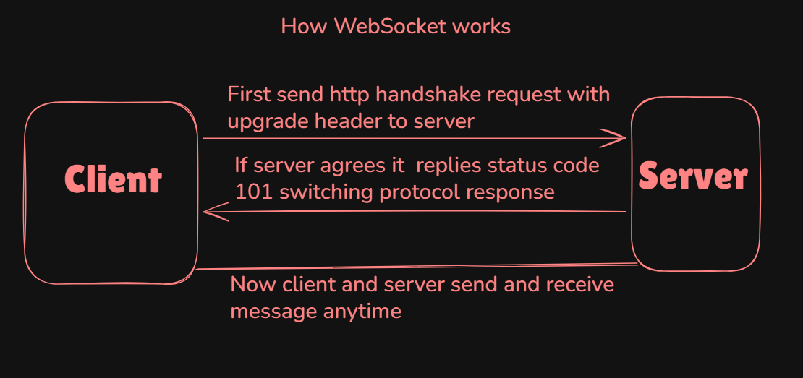

# What is WebSocket ? 
WebSocket is a  Communication Protocol that create a Persistent (permanent) connection between client and server.Once connected, both can send data anytime without waiting.
<br>
In Simple words we can say that WebSocket allows real-time, two-way communication , bi-directional and full-Duplex communication between client and server over a single connection.
<br>
This is different from traditional HTTP , which follows a request-response model.
<br>
In WebSocket Protocol, WebSocket = open connection -> continuous communication.
<br>

WebSocket Protocol use to Protocol :
<br>
1. ws (not secure)
<br>
2. wss (secure)

<b>Real-Time Application Examples</b>

```bash
1.  Chat apps (like WhatsApp)

2.  Live stock price updates

3.  Multiplayer games

4.  Live dashboards (analytics)

5. Notifications (Facebook, Instagram)

```

# Why WebSocket is used ?
WebSocket is used when you need instant updates (real-time).


# Difference between HTTP and WebSocket ?

```bash

              HTTP                     |            WebSocket
 
1. http is a request-response          |  1. WebSocket is a continuous, two-way 
   protocol.                           |      communication protocol.

2. In http client sends a request,     |  2. In WebSocket a single connection is established 
   the server responds, and the             and kept open, allowing both client and 
   connection is closed after each          server to  send data at any time without 
   interaction.                        |     repeatedly reconnecting.   
                                           
3. Connection closes after each request|   3. Connection remains open   

4. Stateless                           |   4. Stateful

5. Requires new request for each       |   5. Continuous data exchange over same connection
 data exchange


```

# How WebSocket Works :

```bash

step 1.
Client sends http request to server Includes Upgrade header asking to switch protocol.

step 2.
If Server accepts request it upgrades connection and send Responds with 101 Switching Protocols.
Now http protocol become websocket.

step 3.
A persistent connection is created between client and server. It stays open (no closing after response)

step 4.
Now, Two-way communication starts means Client can send data anytime. Server can also send data anytime

step 5.
Messages are sent in small packets called frames

step 6.
Connection stays alive. Until client or server closes it

```



# Simple WebSocket Server :
You can send request from https://hoppscotch.io/realtime/websocket if you not created client


```bash
import express from "express"
import { WebSocketServer } from "ws"
const app = express()

const PORT = 8080

const server = app.listen(PORT,()=>{
    console.log(`Server is Running on ${PORT}`)
})

const wss = new WebSocketServer({server})

wss.on("connection", (ws)=>{
    ws.on("message", (data)=>{
        console.log("Data from Client %s :", data)
        ws.send("Response from server, Hello client")
    })
})

```


